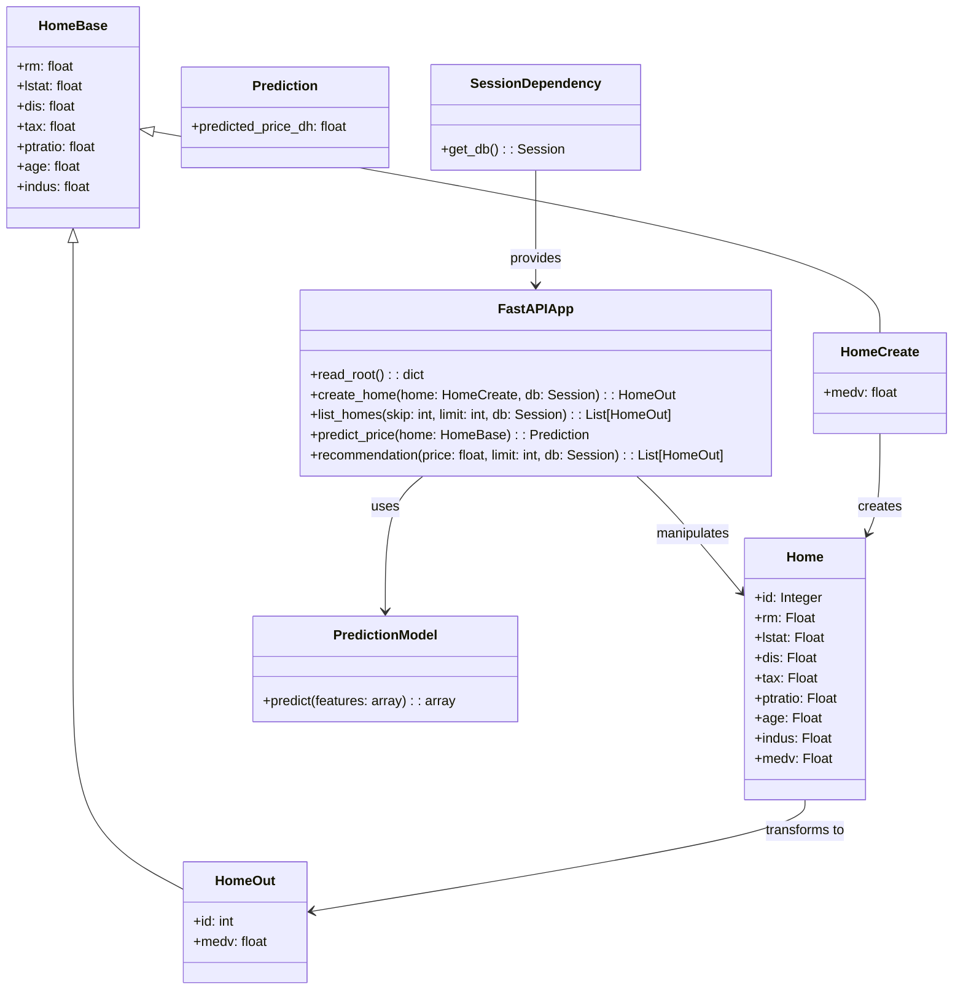
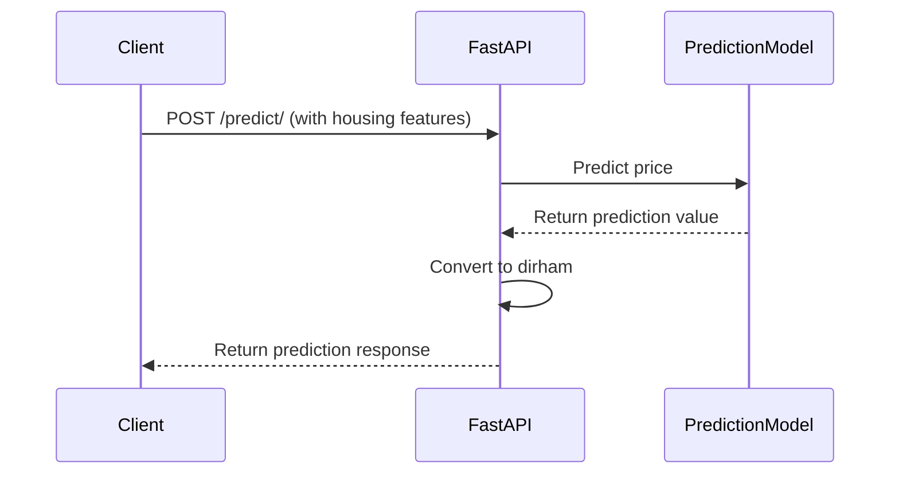
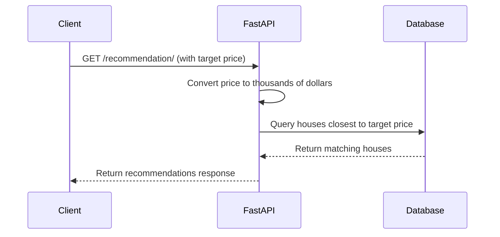

# Boston Housing API

## 1. Introduction

This report documents the development of a Boston Housing Predictor API, a web service that predicts housing prices based on the Boston Housing dataset. The project integrates machine learning with a web API framework to provide real-time housing price predictions and recommendations.

The application is built using FastAPI as the web framework, SQLite for data persistence, and scikit-learn for the machine learning capabilities. The API exposes endpoints for creating new housing entries, retrieving housing data, making price predictions, and receiving housing recommendations based on target prices.

Key features of the Boston Housing API include:
- Data storage and retrieval for Boston housing information
- ML-powered price prediction from housing attributes
- House recommendation system based on price similarity
- RESTful API interface with automatic documentation

## 2. Regression Model

### 2.1 Dataset Overview

The project uses the Boston Housing dataset, a well-known dataset in machine learning containing information about housing in various suburbs of Boston. The dataset includes the following features used in our implementation:

- `rm`: Average number of rooms per dwelling
- `lstat`: Percentage of lower status population
- `dis`: Weighted distances to employment centers
- `tax`: Property tax rate
- `ptratio`: Pupil-teacher ratio
- `age`: Proportion of owner-occupied units built prior to 1940
- `indus`: Proportion of non-retail business acres per town
- `medv`: Median value of owner-occupied homes in $1000s (target variable)

### 2.2 Model Development

The machine learning model was developed using scikit-learn's pipeline architecture, which combines preprocessing steps with the regression algorithm. The pipeline includes:

1. **Data Splitting**: The dataset was split into training (80%) and testing (20%) sets.
2. **Feature Engineering**: The pipeline includes:
   - Feature scaling using StandardScaler
   - Polynomial feature generation (degree=2) to capture non-linear relationships
3. **Regression Model**: Ridge Regression with alpha=10 to prevent overfitting

```python
# Build a pipeline: scaling -> polynomial features -> ridge regression
pipeline = Pipeline([
    ('scaler', StandardScaler()),
    ('poly', PolynomialFeatures(degree=2, include_bias=False)),
    ('model', Ridge(alpha=10))
])
```

### 2.3 Model Performance

The model achieved significantly better performance than baseline approaches:

| Metric | Baseline Model | Improved Model |
|--------|--------------|---------------|
| R² Score | 0.639 | 0.821 |
| MAPE | 18.0% | 12.2% |
| RMSE | N/A | 3.618 k$ |

With a Mean Absolute Percentage Error (MAPE) of 12.2%, the model achieves a regression accuracy of 87.8%, making it reliable for housing price predictions.

### 2.4 Model Deployment

The trained pipeline was serialized using joblib and saved as `pipeline.pkl` for use in the FastAPI application:

```python
with open('pipeline.pkl', 'wb') as f:
    pickle.dump(pipeline, f, protocol=pickle.HIGHEST_PROTOCOL)
```

## 3. UML Diagrams

### 3.1 Class Diagram

Based on the project's implementation, the following class diagram represents the core components of the Boston Housing API:



This diagram shows the core components of the application:
- Data models (SQLAlchemy and Pydantic)
- API controllers (FastAPI routes)
- ML prediction model
- Database dependency

### 3.2 Sequence Diagram for Price Prediction



### 3.3 Sequence Diagram for House Recommendation



## 4. FastAPI Technology and Built-in Functionality

### 4.1 FastAPI Overview

FastAPI is a modern, high-performance web framework for building APIs with Python based on standard Python type hints. Key advantages that made it suitable for this project include:

1. **Performance**: FastAPI is built on Starlette and Pydantic, making it one of the fastest Python frameworks available.
2. **Automatic Documentation**: FastAPI generates interactive API documentation (Swagger UI and ReDoc) automatically.
3. **Data Validation**: Using Pydantic models, FastAPI validates request data automatically.
4. **Dependency Injection**: The framework provides a clean way to inject dependencies like database sessions.
5. **Modern Python Features**: FastAPI leverages Python 3.6+ features including type hints and async/await.

### 4.2 Key FastAPI Features Used in the Project

#### 4.2.1 Pydantic Models for Data Validation

The project uses Pydantic models to validate incoming request data and define response schemas:

```python
class HomeBase(BaseModel):
    rm: float
    lstat: float
    dis: float
    tax: float
    ptratio: float
    age: float
    indus: float

class HomeCreate(HomeBase):
    medv: float  # Include actual median value when creating

class HomeOut(HomeBase):
    id: int
    medv: float
    class Config:
        orm_mode = True
```

#### 4.2.2 Dependency Injection

The project uses FastAPI's dependency injection system to manage database sessions:

```python
def get_db():
    db = SessionLocal()
    try:
        yield db
    finally:
        db.close()
```

#### 4.2.3 Path Operations (Route Handlers)

The API exposes several endpoints defined as path operation functions:

```python
@app.get("/homes/", response_model=list[HomeOut])
def list_homes(skip: int = 0, limit: int = 100, db: Session = Depends(get_db)):
    return db.query(Home).offset(skip).limit(limit).all()
```

#### 4.2.4 Automatic Documentation

FastAPI automatically generates interactive API documentation using Swagger UI and ReDoc:

- Swagger UI available at `/docs`
- ReDoc available at `/redoc`

This documentation includes:
- Request and response schemas
- Example request bodies
- Available query parameters
- HTTP status codes
- Authentication requirements (if any)

## 5. Database and API Endpoints

### 5.1 Database Structure

The application uses SQLite database with SQLAlchemy as the ORM. The database consists of a single table:

**Table: homes**

| Column | Type | Description |
|--------|------|-------------|
| id | Integer | Primary key |
| rm | Float | Average number of rooms |
| lstat | Float | % lower status of the population |
| dis | Float | Weighted distances to employment centers |
| tax | Float | Property tax rate |
| ptratio | Float | Pupil-teacher ratio |
| age | Float | Proportion of owner-occupied units built prior to 1940 |
| indus | Float | Proportion of non-retail business acres |
| medv | Float | Median value in $1000s |

### 5.2 API Endpoints

The API exposes the following endpoints:

#### 5.2.1 Root Endpoint

```
GET /
```

**Description**: Returns a welcome message.  
**Response**:
```json
{
  "message": "Welcome to the Boston Housing Predictor API"
}
```

#### 5.2.2 Create Home

```
POST /homes/
```

**Description**: Creates a new home entry in the database.  
**Request Body**:
```json
{
  "rm": 6.5,
  "lstat": 4.98,
  "dis": 6.0,
  "tax": 296,
  "ptratio": 15.3,
  "age": 65.2,
  "indus": 2.31,
  "medv": 24.0
}
```
**Response**: The created home object with its ID.

#### 5.2.3 List Homes

```
GET /homes/
```

**Description**: Returns a list of homes from the database.  
**Query Parameters**:
- `skip` (int, default: 0): Number of records to skip
- `limit` (int, default: 100): Maximum number of records to return
**Response**: Array of home objects.

#### 5.2.4 Predict Price

```
POST /predict/
```

**Description**: Predicts the price of a home based on its features.  
**Request Body**:
```json
{
  "rm": 6.5,
  "lstat": 4.98,
  "dis": 6.0,
  "tax": 296,
  "ptratio": 15.3,
  "age": 65.2,
  "indus": 2.31
}
```
**Response**:
```json
{
  "predicted_price_dh": 259600.0
}
```
Note: The response is in dirhams (original prediction in $1000s * 1000 * 10).

#### 5.2.5 Get Recommendations

```
GET /recommendation/
```

**Description**: Returns homes with values closest to the specified price.  
**Query Parameters**:
- `price` (float): Target price in dirhams
- `limit` (int, default: 20): Maximum number of recommendations
**Response**: Array of home objects ordered by price similarity.

### 5.3 Request and Response Flow

For each API endpoint, the request and response flow follows this pattern:

1. **Request Validation**: FastAPI validates incoming requests against Pydantic models
2. **Database Interaction**: The API interacts with the SQLite database via SQLAlchemy ORM
3. **Model Prediction** (for `/predict/`): The API uses the loaded scikit-learn model
4. **Response Serialization**: FastAPI serializes the response using Pydantic models

## 6. Project Structure

The project is organized with the following structure:

```
boston-housing-api/
├── homes.db               # SQLite database
├── load_data.py           # Script to load data from CSV to database
├── main.py                # FastAPI application
├── pipeline.pkl           # Serialized ML model
├── README.md              # Project documentation
└── requirements.txt       # Project dependencies
```

### Component Description:

- **homes.db**: SQLite database storing the Boston housing data
- **load_data.py**: Script that downloads the Boston housing dataset, filters required columns, and inserts records into the database
- **main.py**: Main FastAPI application defining models, routes, and API logic
- **pipeline.pkl**: Serialized scikit-learn pipeline containing preprocessing steps and Ridge regression model
- **requirements.txt**: Project dependencies for easy installation

## 7. Conclusion

The Boston Housing API project successfully integrates machine learning with a modern web API framework to create a practical housing price prediction service. The combination of FastAPI, SQLAlchemy, and scikit-learn provides a powerful, efficient, and developer-friendly solution.

Key achievements of the project include:
- Development of a high-performance regression model with 87.8% accuracy
- Creation of a RESTful API with automatic documentation
- Implementation of a recommendation system based on price similarity
- Integration of data persistence using SQLAlchemy and SQLite

### Frontend Work

The API endpoints developed in this project provide a solid backend foundation ready to be integrated with frontend applications. An Angular-based frontend could leverage these endpoints to create an interactive housing price prediction and recommendation system for end users.
